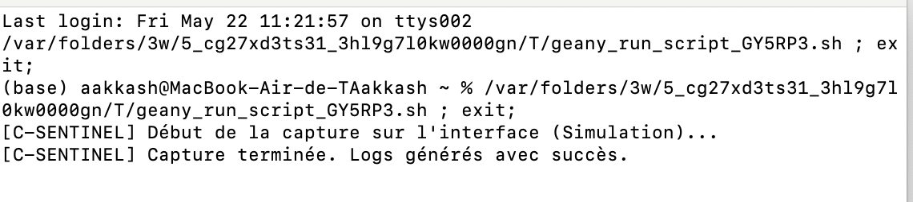
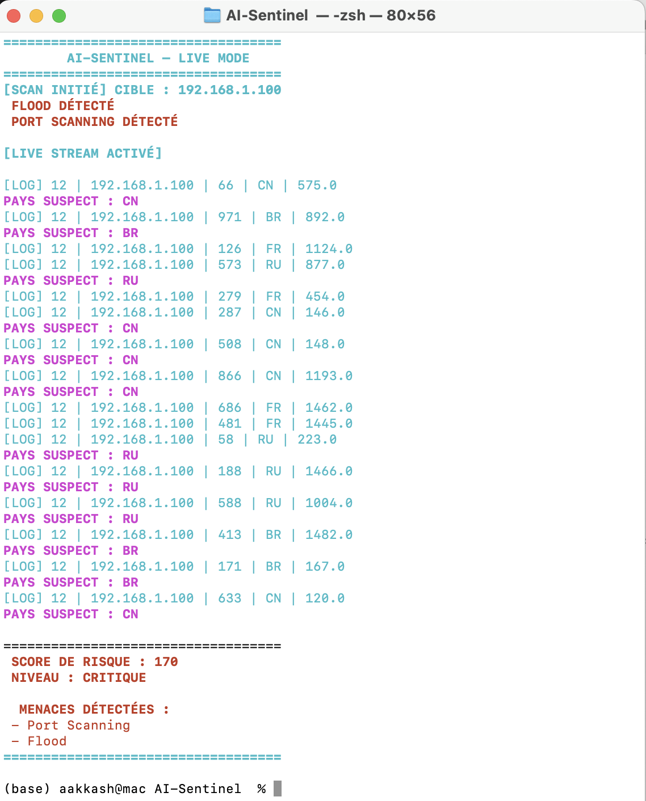

# AI-Sentinel


## Cahier des charges

Le système doit auditer en continu le trafic réseau afin d'isoler les comportements malveillants.

- Le programme en C réalise un contrôle de formatage amont.
- Le script Python interprète les résultats statistiques.
- En cas de flux corrompu ou d'altération du fichier intermédiaire, le programme doit immédiatement lever une alerte critique et se mettre en sécurité.

---

## Exemple d'exécution du projet

### Capture du module C de capture réseau



*Capture d'écran du terminal lors de la capture des flux par le module C.*

---

### Détection d'anomalie par le moteur IA Python



*Détection d'une anomalie volumétrique par le moteur IA en Python.*

---

## Manuel utilisateur

Pour exécuter le système complet de surveillance, ouvrez votre terminal Linux et lancez la commande suivante :

```bash
python3 sentinel_main.py trafic_reseau.csv
```